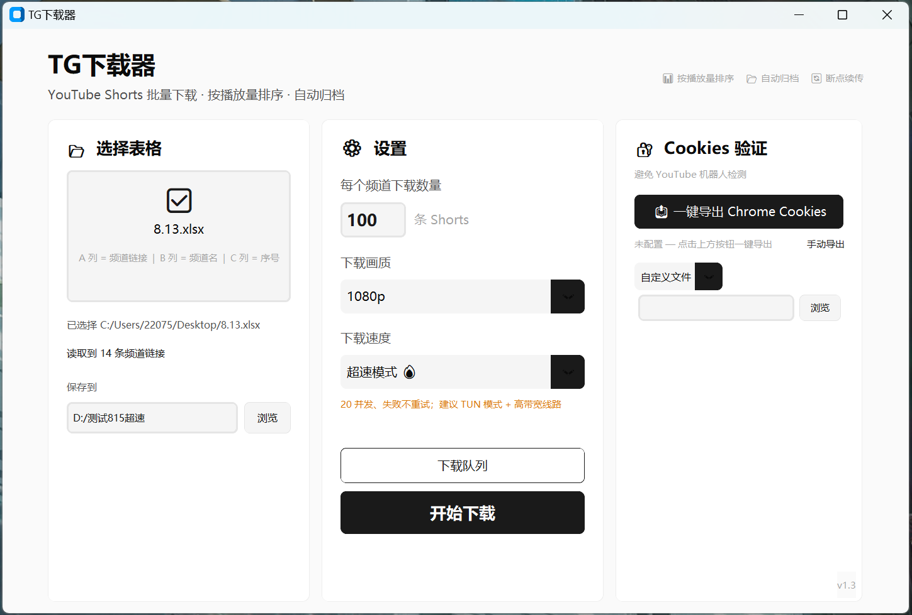
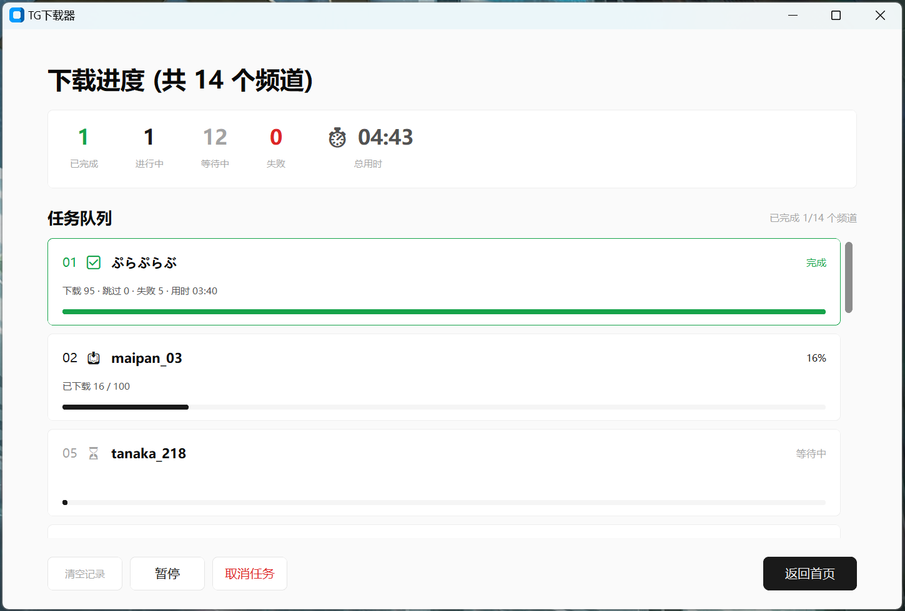

# TG-downloader

面向视频内容团队的 YouTube Shorts 批量归档工具：Excel 批量导入频道 → 按播放量自动排序 → 高并发下载 → 自动命名归档。

真实商用项目，服务于某 30 人规模视频内容公司，用于频道素材的日常采集归档工作流。

> **说明**：本仓库为**架构展示版**。生产环境中的下载调优策略（格式精细过滤、反检测配置、代理适配、错误分类与重试参数）属于商用配置，未开源。完整版为闭源商用软件。展示版代码可运行，但不包含上述生产调优。

## 截图

**主页面**（三栏：Excel 文件选择 / 下载设置 / Cookies 验证）：



**下载进度页**（实时任务队列 + 统计 + 总用时计时）：



## 功能

- 📊 **Excel 批量导入**：A 列频道链接、B 列频道名、C 列序号，一次拖入批量处理
- 🏆 **按播放量排序**：自动发现频道全部 Shorts，按播放量降序取 Top N
- 📂 **自动归档**：每个频道独立命名文件夹（序号_频道名）
- 🔄 **断点续传**：中断后重跑自动跳过已完成视频；完成记录与输出目录分离
- ⏯️ **即时暂停/取消**：秒级响应（基于 progress hook 的中断机制）
- ⚡ **三档速度模式**：稳定 / 极速 / 超速，对应不同网络环境
- 🖱️ **文件拖拽**、多队列追加、进度统计与计时

## 架构

```
┌─────────────────────────────────────────────┐
│                    GUI 层                     │
│  start_page（三栏设置） / progress_page（队列） │
│  线程模型：worker → queue.Queue → after() 轮询 │
├─────────────────────────────────────────────┤
│                 orchestrator                 │
│  任务编排、进度事件系统、暂停/取消信号传播        │
├──────────────┬──────────────┬────────────────┤
│  discoverer  │  downloader  │  excel_reader  │
│  Shorts 发现  │  并发下载     │  Excel 解析    │
│  缓存+排序    │  断点续传     │  URL 规范化    │
├──────────────┴──────────────┴────────────────┤
│           config / license 抽象层             │
│    本地配置读写      LicenseManager 接口       │
│                    (stub → remote 可扩展)     │
└─────────────────────────────────────────────┘
```

## 技术亮点

### 1. GUI 线程模型（永不冻结）

下载在工作线程中以 ThreadPoolExecutor 并发执行，UI 更新通过 `queue.Queue` 传递事件，主线程用 `after()` 轮询消费。事件处理异常不会中断轮询链（`finally` 保证续订）。

### 2. 事件驱动进度系统

编排层发出语义化事件（`channel_start` / `channel_discover` / `channel_download` / `channel_done` ...），UI 只消费事件不关心实现，CLI/GUI 可共用同一编排层。

### 3. 即时暂停/取消机制

利用 yt-dlp progress hook 中抛异常可立即中止下载的特性，自定义 `_Cancelled` / `_Paused` 异常注入下载线程：

- 暂停：挂起下载，`.part` 文件保留，恢复后自动续传
- 取消：1-2 秒内所有下载线程自我中止，无僵尸任务

### 4. 断点续传设计

完成记录（video id 集合）以目标目录 hash 为键存于独立缓存目录——**输出文件夹始终保持纯净**（无 `.json` 污染），且支持同一批视频多次追加任务不重复下载。

### 5. License 抽象层

`LicenseManager` 接口 + Stub 实现：开发期无感，商用期可替换为远程激活实现（服务端校验、会员分级），调用方零改动。

## 实测数据（生产版）

同一频道 50 个视频（1080p）对比：

| 模式 | 单视频墙钟耗时 | 相对速度 |
|---|---|---|
| 稳定 | ~6.0 s | 1.0× |
| 极速 | ~3.9 s | 1.5× |
| 超速 | ~2.8 s | 2.1× |

> 瓶颈分析：单连接限速 → 多连接突破；带宽上限 → 并发数填充固定开销间隙。调优的完整推理链与参数选择见商用版文档。

## 快速开始（展示版）

```bash
pip install -r requirements.txt
python main.py
```

需自备 ffmpeg（PATH 或 `assets/ffmpeg.exe`）。

## License

MIT（仅限本仓库展示版代码；商用版为闭源软件）
